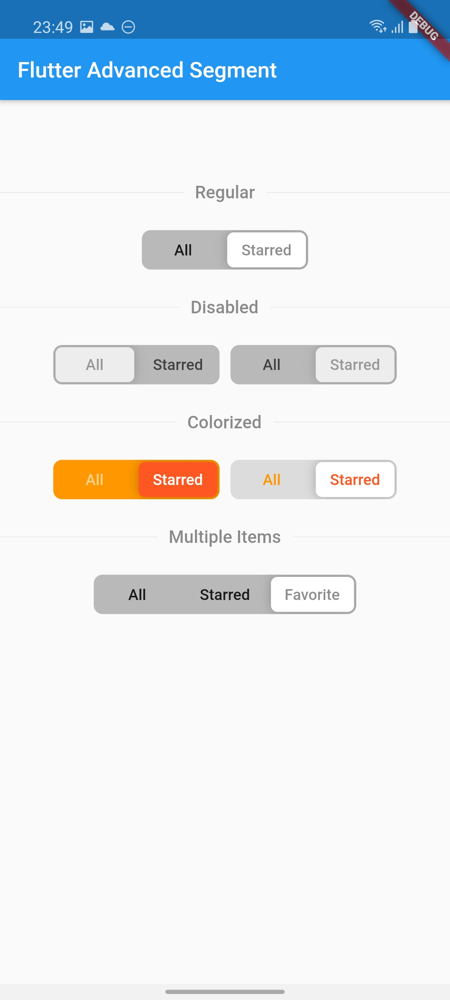

# flutter_advanced_segment
An advanced segment widget, that can be fully customized.

| 1 | 2 | 3 |
|:-:|:-:|:-:|
|  |  |  |

## Getting Started
In the `pubspec.yaml` of your flutter project, add the following dependency:

```yaml
dependencies:
    ...
    flutter_advanced_segment: <latest_version>
```

Import in your project:

```dart
import 'package:flutter_advanced_segment/flutter_advanced_segment.dart';
```