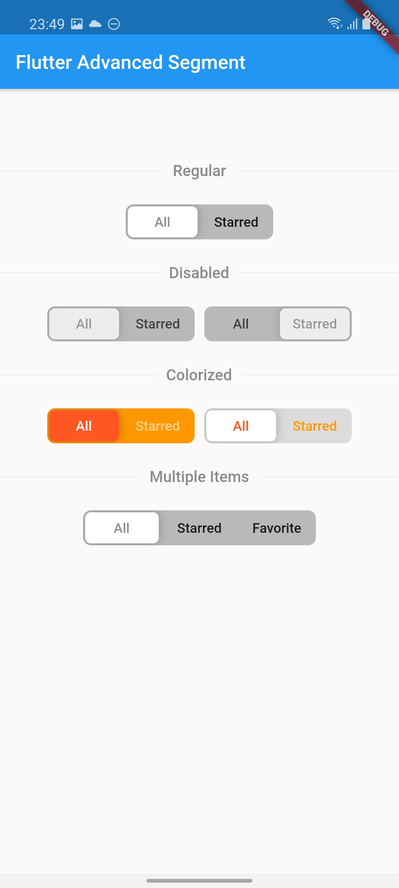
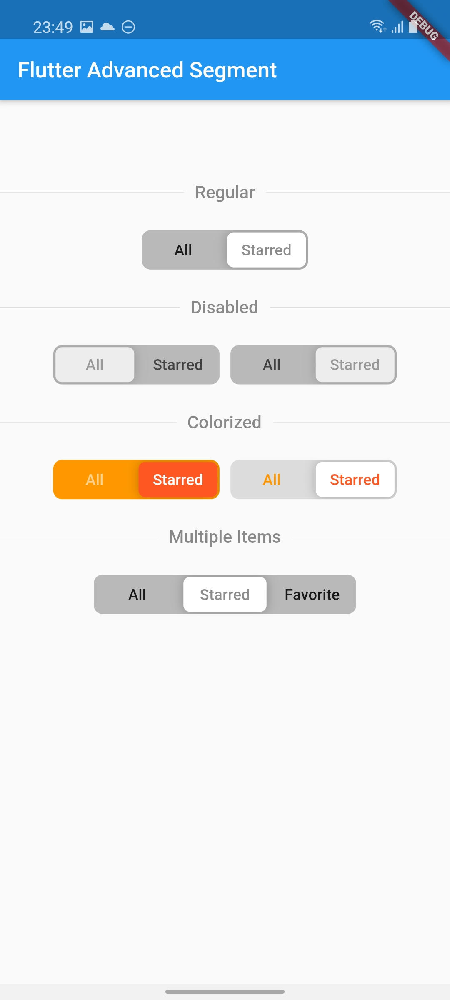
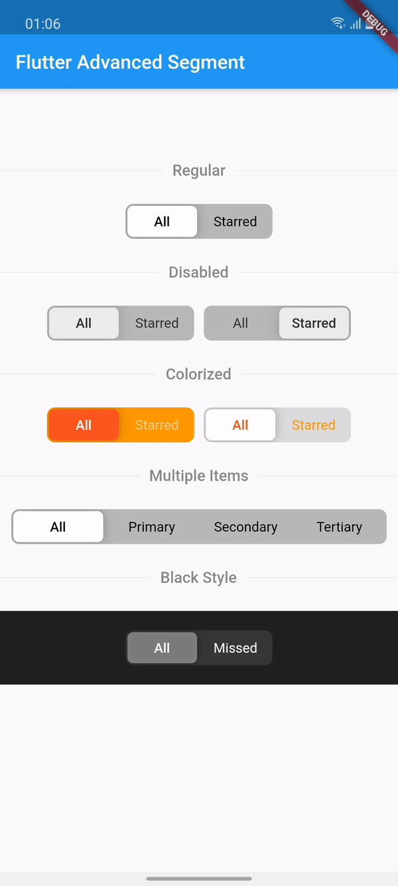

# flutter_advanced_segment
An advanced segment widget, that can be fully customized.

| State 1 | State 2 |
|:-:|:-:|
|  |  |

## Getting Started
In the `pubspec.yaml` of your flutter project, add the following dependency:

```yaml
dependencies:
    ...
    flutter_advanced_segment: <latest_version>
```

Import in your project:

```dart
import 'package:flutter_advanced_segment/flutter_advanced_segment.dart';
```

## Examples

Regular Segment

```dart
//...
AdvancedSegment(
  segments: { // Map<String, String>
    'all': 'All',
    'starred': 'Starred',
  },
  value: _value, // String
  onValueChanged: (value) => setState(() { // ChangeHandler<String>
    _value = value;
  }),
),
//...
``` 

Customized Segment

```dart
//...
AdvancedSegment(
  segments: { // Map<String, String>
    'all': 'All',
    'primary': 'Primary',
    'secondary': 'Secondary',
    'tertiary': 'Tertiary',
  },
  value: _value, // String
  activeStyle: TextStyle( // TextStyle
    color: Colors.white,
    fontWeight: FontWeight.w600,
  ),
  inactiveStyle: TextStyle( // TextStyle
    color: Colors.white54,
  ),
  backgroundColor: Colors.black26, // Color
  sliderColor: Colors.white, // Color
  sliderOffset: 2.0, // Double
  borderRadius: const BorderRadius.all(Radius.circular(8.0)), // BorderRadius
  itemPadding: const EdgeInsets.symmetric( // EdgeInsets
    horizontal: 15,
    vertical: 10,
  ),
  onValueChanged: (value) => setState(() { // ChangeHandler<String>
    _value = value;
  }),
),
//...
``` 

# Demo

