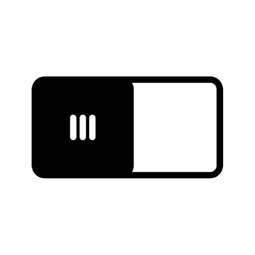
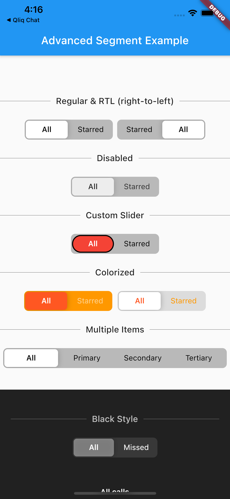
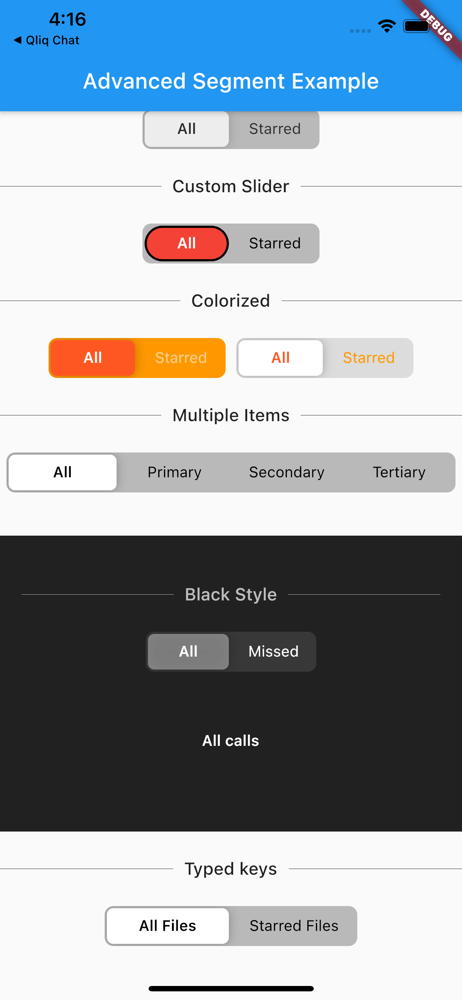

# flutter_advanced_segment
An advanced segment widget, that can be fully customized with bunch of properties, just try it and enjoy! 



| | |
|---|---|
|  |  |

## Examples

### Regular Segment

```dart
final _controller = ValueNotifier('all');
//...
AdvancedSegment(
  controller: _controller,
  segments: const {
    'all': 'All',
    'starred': 'Starred',
  },
),
``` 

### Colorized Segment

```dart
AdvancedSegment(
  controller: _controller,
  segments: const {'all': 'All', 'starred': 'Starred'},
  decoration: BoxDecoration(
    color: const Color(0xFFFF6B35),
    borderRadius: BorderRadius.circular(4),
  ),
  sliderColor: const Color(0xFFD63B0E),
  activeStyle: const TextStyle(
    color: Colors.white,
    fontWeight: FontWeight.w600,
  ),
  inactiveStyle: TextStyle(
    color: Colors.white.withValues(alpha: 0.7),
  ),
),
```

### Gradient Decoration

```dart
AdvancedSegment(
  controller: _controller,
  segments: const {'all': 'All', 'starred': 'Starred'},
  decoration: BoxDecoration(
    gradient: const LinearGradient(
      colors: [Color(0xFFFF2D55), Color(0xFFFF9500)],
    ),
    borderRadius: BorderRadius.circular(16),
  ),
  sliderColor: Colors.white,
  activeStyle: const TextStyle(
    color: Color(0xFFFF2D55),
    fontWeight: FontWeight.w700,
  ),
  inactiveStyle: TextStyle(
    color: Colors.white.withValues(alpha: 0.85),
  ),
),
```

### Custom Slider Decoration

```dart
AdvancedSegment(
  controller: _controller,
  segments: const {'all': 'All', 'starred': 'Starred'},
  decoration: BoxDecoration(
    color: const Color(0xFF2C2C2E),
    borderRadius: BorderRadius.circular(50),
  ),
  sliderDecoration: BoxDecoration(
    color: const Color(0xFFBF5AF2),
    borderRadius: BorderRadius.circular(50),
    border: Border.all(
      color: const Color(0xFFDA8FFF),
      width: 1.5,
    ),
  ),
  activeStyle: const TextStyle(
    color: Colors.white,
    fontWeight: FontWeight.w700,
  ),
  inactiveStyle: TextStyle(
    color: Colors.white.withValues(alpha: 0.5),
  ),
),
```

## AdvancedSegment Parameters
|Parameter|Description|Type|Default|
|:--------|:----------|:---|:------|
|`controller`|Controls segments selection|*ValueNotifier*||
|`segments`|Map of presented segments|*Map<K, V>*|required|
|`activeStyle`|Active segment text style|*TextStyle*|fontWeight: FontWeight.w600|
|`inactiveStyle`|Inactive segment text style|*TextStyle*||
|`decoration`|Layout decoration (color, border, borderRadius, gradient, etc.)|*BoxDecoration*|color: 0x42000000, borderRadius: 8.0|
|`sliderColor`|Color of the slider thumb|*Color*|Colors.white|
|`sliderOffset`|Gap between slider and layout|*double*|2.0|
|`itemPadding`|Padding of each item|*EdgeInsets*|EdgeInsets.symmetric(h: 15, v: 10)|
|`animationDuration`|Selection animation duration|*Duration*|Duration(milliseconds: 250)|
|`shadow`|Slider shadow|*List\<BoxShadow\>*|BoxShadow(blurRadius: 8.0)|
|`sliderDecoration`|Custom slider decoration (overrides sliderColor, borderRadius, shadow)|*BoxDecoration*||
|`enableDrag`|Whether drag gesture is enabled|*bool*|true|

